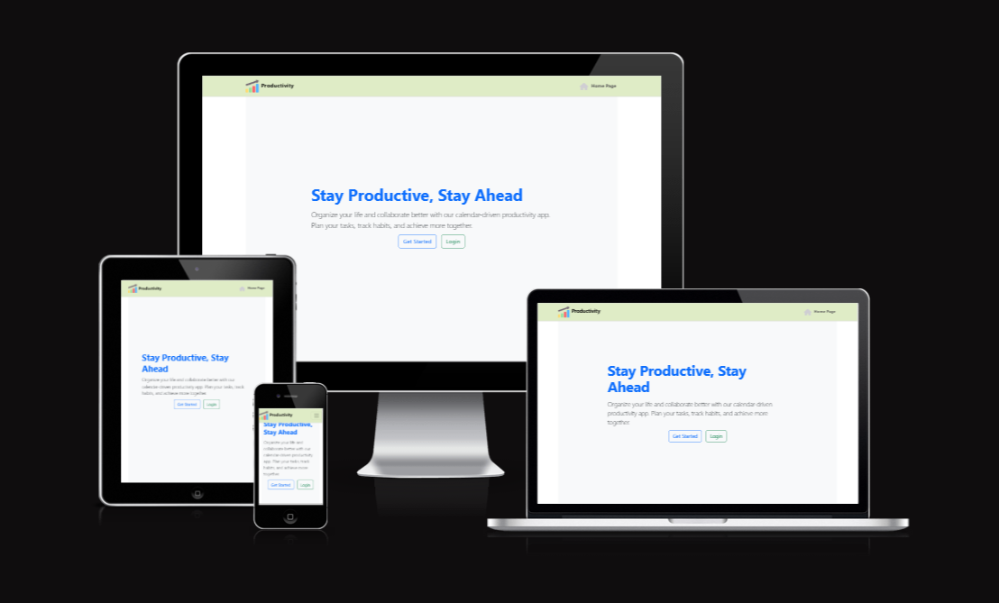

# 📅 Productivity App Project Backend



The **Productivity App** project focuses on developing a **calendar-driven application** designed to help users organize their time efficiently. This **browser-based platform** allows users to create and manage **tasks and habits** effectively.
This application is built to ensure a **seamless user experience** in maintaining daily productivity through a clean, intuitive interface and smart task organization tools.

[View the website here](https://pp5-productivity-frontend.onrender.com/)

## Table of contents

- [Project goals](#project-goals)
- [Planning](#planning)

* [Data models](#data-models)
  - [**Category**](#category)
  - [**Priority**](#priority)
  - [**TaskStatus**](#taskstatus)
  - [**Task**](#task)
  - [**UsrProfile**](#userprofile)
  - [**Settings**](#settings)
  - [**Attachment**](#attachment)

- [API endpoints](#api-endpoints)
- [Frameworks, libraries and dependencies](#frameworks--libraries-and-dependencies)
  - [django-cloudinary-storage](#django-cloudinary-storage)
  - [dj-allauth](#dj-allauth)
  - [dj-rest-auth](#dj-rest-auth)
  - [djangorestframework-simplejwt](#djangorestframework-simplejwt)
  - [dj-database-url](#dj-database-url)
  - [psychopg2](#psychopg2)
  - [python-dateutil](#python-dateutil)
  - [django-recurrence](#django-recurrence)
  - [django-filter](#django-filter)
  - [django-cors-headers](#django-cors-headers)
- [Testing](#testing)
  - [Manual testing](#manual-testing)
  - [Automated tests](#automated-tests)
  - [Python validation](#python-validation)
  - [Resolved bugs](#resolved-bugs)
    - [Bugs found while testing the API in isolation](#bugs-found-while-testing-the-api-in-isolation)
    - [Bugs found while testing the React front-end](#bugs-found-while-testing-the-react-front-end)
  - [Unresolved bugs](#unresolved-bugs)
- [Deployment](#deployment)
- [Credits](#credits)

---

## Project Goals

This project provides a Django Rest Framework API for the [Productivity App Project](https://github.com/yohannes2025/pp5_productivity_app_frontend).

The **Productivity App** project focuses on developing a **calendar-driven application** designed to help users organize their time efficiently. This **browser-based platform** allows users to create and manage **tasks and habits** effectively.
This application is built to ensure a **seamless user experience** in maintaining daily productivity through a clean, intuitive interface and smart task organization tools.

## Planning

Planning started by creating epics and user stories for the frontend application, based on the project goals. The user stories were used to inform wireframes mapping out the intended functionality and 'flow' through the app. See the [repo for the frontend React app](https://github.com/yohannes2025/project-5-productivity-frontend) for more details.

The user stories requiring implementation to achieve a minimum viable product (MVP) were then mapped to API endpoints required to support the desired functionality.

# productivity_app/models.py

### Category Model

- Represents a category for tasks.
- **Fields:**
  - `name`: `CharField(max_length=100)` - The name of the category (e.g., "Work", "Personal").
- **`__str__` method:** Returns the name of the category, making it human-readable in the Django admin and other contexts.

### Priority Model

- Represents the priority level of a task.
- **Fields:**
  - `name`: `CharField(max_length=50)` - The name of the priority level (e.g., "High", "Medium", "Low").
  - `level`: `IntegerField(help_text="Lower number = higher priority")` - An integer representing the priority level. A lower number indicates a higher priority.
- **`__str__` method:** Returns a string combining the priority name and its level (e.g., "High (1)").

### TaskStatus Model

- Represents the status of a task.
- **Fields:**
  - `name`: `CharField(max_length=50)` - The name of the task status (e.g., "Pending", "In Progress", "Completed").
- **`__str__` method:** Returns the name of the task status.

### Task Model

- Represents a single task in the application.
- **Fields:**
  - `title`: `CharField(max_length=200)` - The title of the task.
  - `description`: `TextField(blank=True, null=True)` - A more detailed description of the task. Allows for empty or null values.
  - `due_date`: `DateField()` - The date when the task is due.
  - `created_at`: `DateTimeField(auto_now_add=True)` - Automatically set to the current time when the task is created.
  - `updated_at`: `DateTimeField(auto_now=True)` - Automatically updated to the current time whenever the task is saved.
  - `category`: `ForeignKey(Category, on_delete=models.SET_NULL, null=True)` - A foreign key relationship to the `Category` model. If a category is deleted, the `category` field of associated tasks will be set to `NULL`. Allows for tasks without a category.
  - `priority`: `CharField(max_length=20, choices=[('low', 'Low'), ('medium', 'Medium'), ('high', 'High')])` - The priority of the task, chosen from predefined options.
  - `status`: `CharField(max_length=20, choices=[('pending', 'Pending'), ('in progress', 'In Progress'), ('completed', 'Completed')])` - The current status of the task, chosen from predefined options.
  - `assigned_users`: `ManyToManyField(User, related_name='assigned_tasks')` - A many-to-many relationship with the built-in `User` model. Allows multiple users to be assigned to a single task, and a user can be assigned to multiple tasks. The `related_name` allows accessing tasks assigned to a user via `user.assigned_tasks`.
  - `owner`: `ForeignKey(settings.AUTH_USER_MODEL, on_delete=models.CASCADE, null=True)` - A foreign key relationship to the user who created the task. Uses the `AUTH_USER_MODEL` setting for flexibility. If the owner user is deleted, all their tasks will be deleted (`on_delete=models.CASCADE`). Allows for tasks without an explicit owner (though this might need consideration based on application logic).
  - `file`: `FileField(upload_to='attachments/', blank=True, null=True)` - Allows uploading a file attachment to the task. Files will be stored in the `attachments/` directory within the media root. Allows for no file to be uploaded.
- **`__str__` method:** Returns the title of the task.

### UserProfile Model

- Represents additional profile information for users. Note that this is a separate model from the built-in `User` model.
- **Fields:**
  - `name`: `CharField(max_length=100)` - The name of the user profile.
  - `avatar`: `ImageField(upload_to='avatars/', null=True, blank=True)` - Allows uploading an avatar image for the user. Images will be stored in the `avatars/` directory within the media root. Allows for no avatar to be uploaded.
- **`__str__` method:** Returns the name associated with the user profile.

# API Endpoints Table

| Endpoint              | Method    | Description                                                                |
| --------------------- | --------- | -------------------------------------------------------------------------- |
| status.               |
| `/api/tasks/`         | GET       | Retrieve a list of all tasks (supports filtering and pagination).          |
| `/api/tasks/`         | POST      | Create a new task (requires relevant fields in request body).              |
| `/api/tasks/<id>/`    | GET       | Retrieve a specific task by its ID.                                        |
| `/api/tasks/<id>/`    | PUT/PATCH | Update an existing task (requires fields to update in request body).       |
| `/api/tasks/<id>/`    | DELETE    | Delete a specific task.                                                    |
| `/api/profiles/`      | GET       | Retrieve a list of all user profiles.                                      |
| `/api/profiles/`      | POST      | Create a new user profile (requires `name` and optionally `avatar`).       |
| `/api/profiles/<id>/` | GET       | Retrieve a specific user profile by its ID.                                |
| `/api/profiles/<id>/` | PUT/PATCH | Update an existing user profile (requires `name` and optionally `avatar`). |
| `/api/profiles/<id>/` | DELETE    | Delete a specific user profile.                                            |

| `/api/users/` | GET | Retrieve authorized users list. |
| `/api/users/me/` | PUT/PATCH | Update settings for a specific user (admin/specific user access). |

## Frameworks, libraries and dependencies

The Productivity API is implemented in Python using [Django](https://www.djangoproject.com) and [Django Rest Framework](https://django-filter.readthedocs.io/en/stable/).

The following additional utilities, apps and modules were also used.

### django-cloudinary-storage

https://pypi.org/project/django-cloudinary-storage/

Enables cloudinary integration for storing user profile images in cloudinary.

### dj-allauth

https://django-allauth.readthedocs.io/en/latest/

Used for user authentication. this package enables registration and authentication using a range of social media accounts.

### dj-rest-auth

https://dj-rest-auth.readthedocs.io/en/latest/introduction.html

Provides REST API endpoints for login and logout.

### djangorestframework-simplejwt

https://django-rest-framework-simplejwt.readthedocs.io/en/latest/

Provides JSON web token authentication.

### dj-database-url

https://pypi.org/project/dj-database-url/

Creates an environment variable to configure the connection to the database.

### psychopg2

https://pypi.org/project/psycopg2/

Database adapater to enable interaction between Python and the PostgreSQL database.

### python-dateutil

https://pypi.org/project/python-dateutil/

This module provides extensions to the standard Python datetime module. It is a pre-requisite for django-recurrence library.

### django-recurrence

https://django-recurrence.readthedocs.io/en/latest/

This utility enables functionality for working with recurring dates in Django. It provides a `ReccurenceField` field type for storing recurring datetimes in the database.

### django-filter

https://django-filter.readthedocs.io/en/stable/

django-filter is used to implement ISO datetime filtering functionality for the `events` GET endpoint. The client is able to request dates within a range using the `from_date` and `to_date` URL parameters. The API performs an additional check after filtering to 'catch' any repeat events within the requested range, where the original event stored in the database occurred beforehand.

### django-cors-headers

https://pypi.org/project/django-cors-headers/

This Django app adds Cross-Origin-Resource Sharing (CORS) headers to responses, to enable the API to respond to requests from origins other than its own host.
Productivity App is configured to allow requests from all origins, to facilitate future development of a native mobile app using this API.

# productivity_app/serializers.py

This file defines the **serializers** for the productivity application. Serializers play a crucial role in Django Rest Framework by converting complex data types, such as Django model instances, into native Python datatypes that can then be easily rendered into JSON, XML, or other content types. They also provide deserialization, allowing parsed data to be converted back into complex types and then validated before saving to the database.

## Task Management Serializers

### FileSerializer

This serializer handles the serialization and deserialization of **file uploads** associated with tasks. It exposes the id and file fields of the File model.

### UserSerializer

A basic serializer for the Django **User** model, primarily used to display user id, username, and email in read-only contexts, such as when listing users assigned to a task.

### TaskSerializer

This is the primary serializer for the **Task** model. It's designed for creating, updating, and retrieving individual task details. Key features include:

- **assigned_users**: Handles the many-to-many relationship with the User model, allowing tasks to be assigned to multiple users. It uses PrimaryKeyRelatedField for writing (sending user IDs) and is integrated with custom create and update methods to manage this relationship properly.
- **upload_files**: A read-only field that nests the FileSerializer to display associated file details when a task is retrieved.
- **read_only_fields**: Automatically generated fields like created_at, updated_at, and the is_overdue property are set as read-only.
- **Custom create and update methods**: These methods are overridden to correctly handle the assignment of users, ensuring that the many-to-many relationship is properly set up or updated after the task itself is created or modified.

### TaskListSerializer

A simplified serializer for listing **Task** instances. It includes a subset of fields (id, title, description, due_date, priority, category, status, created_at, updated_at) optimized for displaying tasks in a list view without excessive detail.

### TaskDetailSerializer

Provides a more detailed view for a single **Task**. It includes all fields from the Task model and explicitly nests UserSerializer for assigned_users to show full user details. It also provides an assigned_user_ids field, which is write_only, allowing you to update assigned users using their IDs while keeping the assigned_users field read-only and displaying the full user objects.

## Authentication & User Serializers

### RegisterSerializer

Handles the **user registration** process. This serializer validates and creates new User and Profile instances. It includes:

- **confirm_password**: An extra write-only field to ensure password confirmation.
- **name**: Used as the username for the new user and to populate the Profile's name field.
- **email**: The user's email address, which must be unique.
- **Custom validate method**: Performs several checks:

  - Ensures password and confirm_password match.
  - Validates password strength using Django's built-in validate_password.
  - Checks for existing usernames and email addresses to prevent duplicates.

- **Custom create method**: Creates a new User using create_user (which handles password hashing) and then updates the associated Profile instance, utilizing the signal defined in models.py.

### LoginSerializer

Manages the **user login** process. This serializer validates user credentials (email and password) and authenticates the user.

- It takes email and password as input.
- The **validate method** checks if both fields are provided, verifies if a user exists with the given email, and then uses user.check_password() to validate the provided password against the hashed password in the database.
- It also checks if the user account is active.

## Profile Serializer

### ProfileSerializer

This serializer handles the serialization and deserialization of the **Profile** model.

- It includes fields like id, name, email, created_at, and updated_at.
- The to_representation method is customized to output a simplified representation of the profile, specifically including the user's id, name, and email from the linked User model.

# productivity_app/views.py

This `views.py` file defines the API endpoints for managing user profiles, tasks, and authentication. It utilizes Django REST Framework's viewsets, generic views, and permissions to create a secure and organized API structure.

---

## 1. **ProfileViewSet**

**Purpose:**  
Provides CRUD operations for user profiles.

- Public can view all profiles.
- Only authenticated users can modify (update/delete) their own profile.

**Key Features:**

- Uses `ModelViewSet` for standard actions (`list`, `retrieve`, `update`, `destroy`).
- Enforces permissions: users can only modify their own profile.
- Overrides `get_object`, `perform_update`, and `perform_destroy` to restrict modifications to the owner.

---

## 2. **TaskViewSet**

**Purpose:**  
Manages tasks, allowing users to view, create, update, or delete tasks they are assigned to.

**Key Features:**

- Uses `ModelViewSet` for full CRUD operations.
- Permissions: only assigned users can edit or delete tasks (`IsAssignedOrReadOnly`).
- `get_queryset`: returns tasks assigned to the current user, or all tasks (if not authenticated).
- `perform_create`: automatically assigns the creating user if no other users are assigned.
- `perform_update` & `perform_destroy`: ensure only assigned users can modify or delete tasks.

---

## 3. **User List and Detail APIs**

### `UsersListAPIView`

- **Purpose:** List all registered users.
- **Access:** Only authenticated users.
- **Implementation:** Simple `APIView` with `GET` method returning serialized user data.

### `UserDetailAPIView`

- **Purpose:** Retrieve, update, or delete the current user's profile.
- **Permissions:** User must be authenticated and can only modify their own data (`IsSelfOrReadOnly`).
- **Implementation:** Extends `RetrieveUpdateDestroyAPIView` with `get_object` returning `request.user`.

---

## 4. **Authentication Endpoints**

### `RegisterViewSet`

- **Purpose:** Handles user registration.
- **Implementation:** `CreateAPIView` that accepts registration data, creates a user (atomically), and returns JWT tokens.
- Uses `transaction.atomic()` to ensure user creation is all-or-nothing.
- On success, responds with success message, user info, and JWT tokens (`refresh` and `access`).

### `LoginViewSet`

- **Purpose:** Handles user login.
- **Implementation:** `APIView` with POST method.
- Validates credentials via `LoginSerializer`.
- If valid, generates JWT tokens and returns them, enabling authenticated sessions.

---

## **Summary**

This `views.py` provides a comprehensive API for:

- Managing user profiles with proper permissions.
- Secure task management, ensuring only assigned users can modify tasks.
- User registration and login with JWT token-based authentication.
- Listing all users and retrieving/updating the current user's profile.

The design prioritizes security (permissions), atomic operations (registration), and user-centric access control, making it suitable for collaborative productivity applications.

# productivity_app/urls.py

This `urls.py` file primarily configures URL routing and JWT token endpoints for the API. It does not define serializers but sets up the URL patterns to connect views with URLs, enabling the API to handle user registration, login, token management, and CRUD operations for tasks and profiles.

---

## 1. **Router Configuration**

- **`DefaultRouter()`**:  
  Creates a router that automatically generates URL patterns for viewsets.

- **`router.register(r'tasks', TaskViewSet, basename='task')`**:  
  Registers the `TaskViewSet`, enabling RESTful URLs for task operations (list, retrieve, create, update, delete).

- **`router.register(r'profiles', ProfileViewSet, basename='profile')`**:  
  Registers the `ProfileViewSet` for profile-related endpoints.

---

## 2. **URL Patterns**

Defines all API endpoints for the application:

### Authentication and User Management

- **Registration**:  
  `path('api/register/', RegisterViewSet.as_view(), name='register')`  
  Endpoint for user registration.

- **Login**:  
  `path('api/login/', LoginViewSet.as_view(), name='login')`  
  Endpoint for user login, returning JWT tokens.

### JWT Token Endpoints (using `rest_framework_simplejwt`)

- **Obtain Token**:  
  `path('api/token/', TokenObtainPairView.as_view(), name='token_obtain_pair')`  
  Retrieves access and refresh tokens upon login.

- **Refresh Token**:  
  `path('api/token/refresh/', TokenRefreshView.as_view(), name='token_refresh')`  
  Refreshes expired access tokens using a refresh token.

- **Verify Token**:  
  `path('api/token/verify/', TokenVerifyView.as_view(), name='token_verify')`  
  Validates the provided JWT token.

### Viewsets and Additional Endpoints

- **Task and Profile Endpoints**:  
  `path('api/', include(router.urls))`  
  Includes all URLs generated by the router for `tasks` and `profiles`.

- **User List**:  
  `path('api/users/', UsersListAPIView.as_view(), name='users-list')`  
  Lists all registered users.

- **Current User Details**:  
  `path('api/users/me/', UserDetailAPIView.as_view(), name='user-detail')`  
  Retrieves, updates, or deletes the current authenticated user's profile.

---

## **Summary**

- Sets up URL routing for user registration, login, and JWT token management.
- Registers viewsets for task and profile CRUD operations.
- Provides endpoints to list all users and access the current user's profile.
- Uses Django REST Framework's router for clean, RESTful URL patterns.

This configuration ensures a structured, secure, and extendable API for the productivity app.

# dfr_api/urls.py

This `urls.py` file configures the URL routing for the Django project. It directs incoming HTTP requests to appropriate views or includes other URL configurations.

---

## 1. **Home View**

- **Function `home(request)`**:  
  Returns a simple JSON response with a welcome message.
  - **Path `'/'`**:  
    When users visit the root URL of the site, they receive this JSON message:
    ```json
    { "message": "Welcome to the Productivity App API" }
    ```

## 2. **URL Patterns**

- **Root Path `'/'`**:  
  Mapped to the `home` view, providing a friendly API welcome message.

- **Admin Path `'admin/'`**:  
  Provides access to Django's built-in admin interface at `/admin/`.

- **API Paths**:
  - **`path('', include('productivity_app.urls', namespace='productivity_app'))`**:  
    Includes all URL patterns defined in the `productivity_app/urls.py` file under the root URL.  
    This means all API endpoints like `/api/register/`, `/api/login/`, `/api/tasks/`, `/api/profiles/`, etc., are accessible directly under the site's base URL.

---

## **Summary**

- Sets up a welcome endpoint at `'/'` that returns a JSON message.
- Connects the Django admin interface at `/admin/`.
- Includes the application's API URL configurations from `productivity_app/urls.py`.

This setup ensures that the main project URL routing is clean, organized, and user-friendly, directing API traffic appropriately and providing a simple landing message.

# Deployment

# Overcoming Deployment Challenges: From Heroku to Render.com

---

Deploying the final project for my **Advanced Front-End portfolio** presented an unexpected hurdle. My initial strategy was to deploy the application to **Heroku**, a platform I had used previously. However, I encountered persistent **network errors** that prevented a successful deployment, despite investing a significant amount of time troubleshooting.

After considerable effort with Heroku yielded no success, I made the decision to switch deployment platforms to **Render.com**. This transition, while necessary, required a considerable amount of time to adjust settings and configurations to suit the new environment.

Crucially, **last week, a Code Institute staff member sent me a Render.com manual**. This alternative solution to Heroku deployment proved invaluable, and I am very thankful for it. The moment my project successfully deployed to Render.com was a **great relief**. It marked the culmination of significant effort and a successful navigation of unforeseen technical difficulties.

# Deploying a Django REST Framework Backend to Render.com

## Prerequisites

Before deploying, ensure:

- You have a working **Django REST Framework (DRF)** project.
- Your project is on **GitHub** or **GitLab**.
- You have a `requirements.txt` file.
- Your project uses a virtual environment.
- You’ve created a free account on [Render](https://render.com/).

---

## Step 1: Prepare Your Django Project for Deployment

### 1.1. Create `requirements.txt`

```bash
pip freeze > requirements.txt
```

### 1.2. Install Gunicorn

```bash
pip install gunicorn
```

Make sure `gunicorn` is added to your `requirements.txt`.

---

### 1.3. (Optional) Create a `render.yaml` for Infrastructure as Code

```yaml
services:
  - type: web
    name: drf-api
    env: python
    plan: free
    buildCommand: "pip install -r requirements.txt"
    startCommand: "gunicorn your_project_name.wsgi:application"
    envVars:
      - key: DJANGO_SETTINGS_MODULE
        value: your_project_name.settings
      - key: SECRET_KEY
        generateValue: true
      - key: DEBUG
        value: false
```

> Replace `your_project_name` with the name of your Django project directory.

---

### 1.4. Update `settings.py` for Production

#### Add Allowed Hosts:

```python
ALLOWED_HOSTS = ['your-service-name.onrender.com']
```

#### Add Static File Config:

```python
STATIC_URL = '/static/'
STATIC_ROOT = os.path.join(BASE_DIR, 'staticfiles')
```

---

### 1.5. Collect Static Files

```bash
python manage.py collectstatic
```

---

## Step 2: Push Your Code to GitHub

```bash
git init
git add .
git commit -m "Initial commit"
git remote add origin https://github.com/yourusername/your-repo.git
git push -u origin main
```

---

## Step 3: Deploy to Render

1. Go to [Render.com](https://render.com/) and log in.
2. Click **“New +” → “Web Service”**.
3. Connect your GitHub repository.
4. Fill out deployment settings:

| Field         | Value                                         |
| ------------- | --------------------------------------------- |
| Name          | drf-api (or any name)                         |
| Environment   | Python                                        |
| Build Command | `pip install -r requirements.txt`             |
| Start Command | `gunicorn your_project_name.wsgi:application` |

5. Add the following environment variables:

```
DJANGO_SETTINGS_MODULE = your_project_name.settings
SECRET_KEY = your-secret-key
DEBUG = false
```

---

## Step 4: (Optional) Add a PostgreSQL Database on Render

1. Go to **“New +” → “PostgreSQL”** in Render.
2. Name it and choose a free plan.
3. Copy the **Internal Database URL**.
4. Update `settings.py`:

```python
import dj_database_url

DATABASES = {
    'default': dj_database_url.config(default=os.getenv('DATABASE_URL'))
}
```

Install `dj-database-url`:

```bash
pip install dj-database-url
```

---

## Step 5: Apply Migrations and Collect Static Files on Render

Use the **Shell** in the Render dashboard:

```bash
python manage.py migrate
python manage.py collectstatic --noinput
```

---

## Step 6: Access Your Live API

Visit:

```
https://your-service-name.onrender.com/
```

Make sure your API routes (e.g. `/api/`) are configured in `urls.py`.

---

## ✅ Final Deployment Checklist

| Task                             | Status |
| -------------------------------- | ------ |
| Code pushed to GitHub            | ✅     |
| `gunicorn` installed             | ✅     |
| Static files configured          | ✅     |
| `DEBUG=False` in production      | ✅     |
| `SECRET_KEY` in environment vars | ✅     |
| PostgreSQL set up (optional)     | ✅     |
| Migrations applied               | ✅     |
| API tested live                  | ✅     |

---

## References

- [Render.com Docs](https://render.com/docs)
- [Django Deployment Checklist](https://docs.djangoproject.com/en/stable/howto/deployment/checklist/)

# 📘 Final Frontend Project Scope Reflection

## 🧠 Project Background

At the start of this project, I set out with a broad and ambitious plan based on a rich set of user stories. My goal was to build a productivity app with not only essential task management features, but also extra views such as:

- A **user profile** section
- A **settings** page
- A **calendar view** for tasks and habits

These were inspired by real-world productivity tools and aimed at providing a professional and complete user experience.

---

## 🎯 What Changed

As the project progressed, I faced time and resource limitations, especially while integrating backend APIs with the frontend and ensuring authentication, CRUD operations, and UX were fully functional and polished.

After much consideration, I made the decision to **narrow the project scope** to focus on **core features** only — the parts of the app that deliver the most value and are essential to meet the assessment requirements.

---

## ✅ Final Features Implemented

Here’s what the final version of the frontend includes:

- ✅ Fully working **authentication system** (Login/Register using JWT)
- ✅ Task management with:
  - Create, read, update, delete (CRUD)
  - File uploads
  - Due dates, priority, state
  - Filtering and sorting
- ✅ Clean, responsive UI with Bootstrap
- ✅ User feedback with spinners and alerts
- ✅ API integration with a deployed Django backend

---

## ❌ Features Postponed for Later

The following views/features were initially planned but **have been postponed** to a potential future upgrade:

- 🚫 **User Profile View**
- 🚫 **Settings Page**
- 🚫 **Calendar-Based Task View**

These features required more time for integration and design, and I decided not to compromise the quality of the existing features just to add more scope.

---

## 💬 Reflection

While it was tough to let go of some planned views, I learned a valuable lesson about **prioritizing core functionality**, **maintainability**, and **realistic deadlines**. These extra features can definitely be revisited later — perhaps in version 2.0 of this project.

The decision to reduce scope was not about giving up — it was about focusing on delivering a stable, complete, and well-tested MVP.

---

## 🚀 What's Next?

I’m excited to explore the remaining features in the future:

- Integrating a **calendar view** using something like `react-calendar` or `fullcalendar`
- Allowing users to view and edit their **profile**
- Adding a **settings panel** for personalization

---

Thanks to this experience, I’ve grown more confident in making practical product decisions and shipping working software — even when it means leaving some things for later.

# Credits

# Acknowledging Support and Opportunity

I want to extend my sincere appreciation to the **Code Institute student care team** for their incredible tolerance and support. My project submission ended up being overdue by approximately a month, and their understanding during this challenging period was invaluable.

Finally, I am profoundly grateful to the **entire Code Institute staff** for providing me with the opportunity to pursue my dream of becoming a **full-stack software developer**. The education and experience have been transformative.

### Acknowledgments

- Thank you very much Code Institute Student Care Team Tutor and Mentor for your dedication and commitment in supporting me to achieve in submitting this Advanced Front-End Full Stack Software Development project and broadening my career opportunities.
